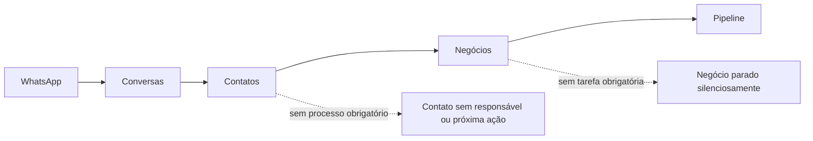
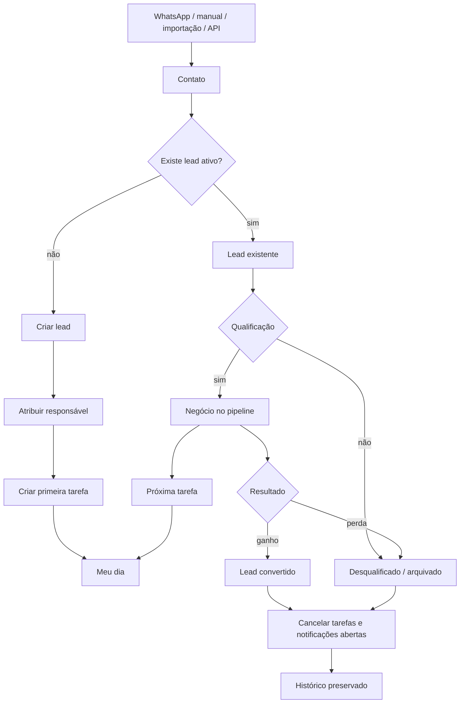
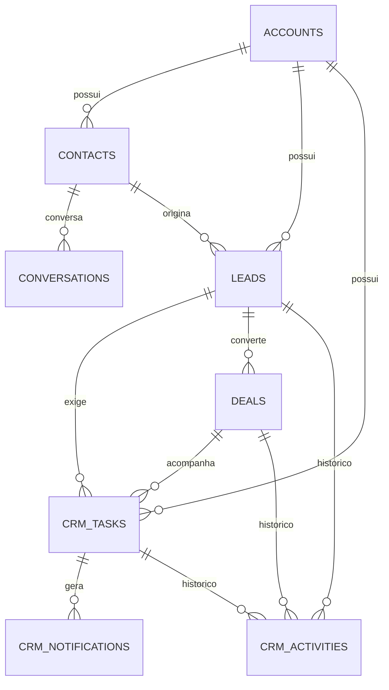
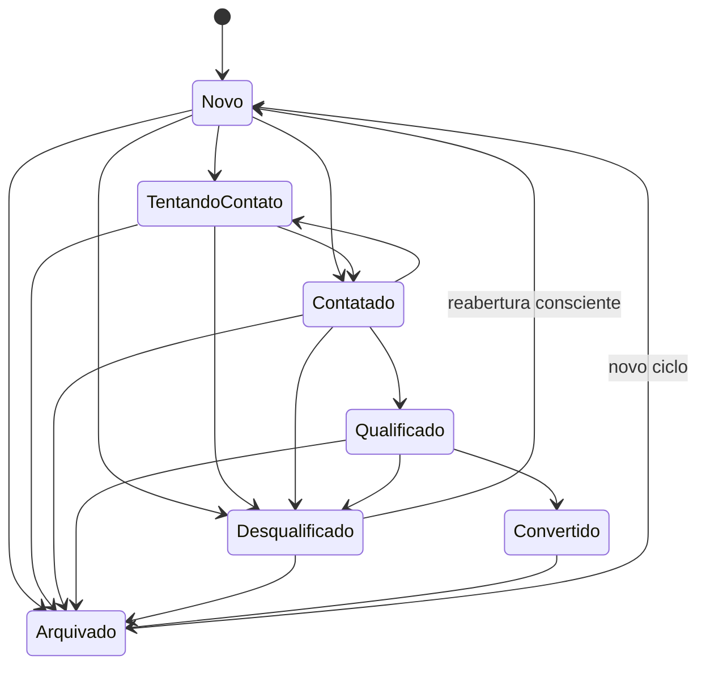

# Finalização do CRM — arquitetura, fluxos e critérios de entrega

Este documento é a fonte de verdade para a evolução do WACRM de uma caixa de entrada com contatos e negócios para um CRM operacional completo, no qual nenhum lead ativo fica sem responsável ou próxima ação.

## 1. Escopo e princípios

A implementação preserva a base existente — Next.js, Supabase, RLS, WhatsApp Cloud API, pipelines, broadcasts, automações e contas compartilhadas — e acrescenta uma camada comercial explícita:

- **Contato** é a pessoa ou empresa cadastrada.
- **Conversa** é um atendimento em um canal.
- **Lead** é um processo de captação e qualificação.
- **Negócio** é uma oportunidade qualificada no pipeline.
- **Tarefa** é a próxima ação operacional.
- **Atividade** é o histórico imutável do que aconteceu.
- **Notificação** é um alerta acionável derivado de uma tarefa.

Princípios obrigatórios:

1. Todo lead ativo possui responsável.
2. Todo novo lead recebe uma primeira tarefa automaticamente.
3. A próxima ação do lead e do negócio deriva das tarefas abertas.
4. Encerrar ou arquivar um lead cancela tarefas abertas e elimina notificações acionáveis.
5. Mensagens recebidas criam um lead somente quando o contato não possui outro lead ativo.
6. Contas diferentes nunca compartilham registros; RLS continua sendo a barreira principal.
7. Atividades comerciais são preservadas para auditoria, mesmo quando relações opcionais deixam de existir.

## 2. Arquitetura atual e arquitetura-alvo

### 2.1 Fluxo anterior

### 2.2 Fluxo implementado

### 2.3 Relações principais

## 3. Inconsistências encontradas e tratamento

| Inconsistência | Risco | Tratamento |
|---|---|---|
| Contato era usado como se fosse lead | Contatos sem processo comercial | Entidade `leads` independente |
| Negócio podia existir sem próxima ação | Pipeline parado sem alerta | `deals.next_action_at` sincronizado com tarefas |
| Exclusão/encerramento podia deixar alertas | Notificações e filas órfãs | Cascatas, cancelamento e dismiss automático |
| WhatsApp não iniciava processo comercial | Mensagens sem acompanhamento | Trigger de mensagem recebida para lead ativo |
| Pipeline e atendimento podiam ter responsáveis divergentes | Duplicidade ou abandono | Lead possui responsável comercial explícito; conversa mantém atendente |
| Não havia fila operacional central | Usuário precisava procurar trabalho em várias telas | Página **Meu dia** |
| Não havia histórico comercial unificado | Auditoria fragmentada | `crm_activities` imutável |
| Usuário podia apagar histórico relevante | Perda de rastreabilidade | Arquivamento de lead e relações com `SET NULL` onde apropriado |
| Dashboard priorizava apenas métricas | Baixa orientação para execução | Ações rápidas para Meu dia e Leads |

## 4. Ciclo de vida do lead

Estados finais cancelam tarefas abertas e descartam notificações acionáveis:

- `disqualified`
- `converted`
- `archived`

## 5. Regras de integridade

### 5.1 Lead

- `account_id`, `contact_id`, criador e responsável são obrigatórios.
- O contato e o lead devem pertencer à mesma conta.
- Existe no máximo um lead ativo por contato e conta.
- A primeira tarefa é criada pelo banco, não pela interface.
- `next_action_at` é calculado a partir da menor data das tarefas abertas.

### 5.2 Tarefa

- Deve possuir pelo menos um contexto: lead, negócio ou contato.
- A conta é validada contra o registro relacionado.
- Ao concluir, `completed_at` é preenchido.
- Ao cancelar, `cancelled_at` é preenchido.
- Ao reabrir, datas de conclusão/cancelamento são removidas.
- A notificação acompanha a situação da tarefa e é removida ao excluir a tarefa.

### 5.3 Pipeline

- Um negócio criado para um contato é vinculado ao lead ativo desse contato.
- Se não existir lead ativo, é criado um lead qualificado.
- Negócio ganho converte o lead.
- Negócio perdido desqualifica o lead e exige motivo na experiência de uso.
- Próxima ação do negócio deriva de tarefas do próprio negócio ou do lead vinculado.

### 5.4 WhatsApp

- Somente mensagens de cliente podem iniciar um lead.
- Mensagens simultâneas são protegidas por índice único parcial e tratamento de concorrência.
- Mensagens de agente ou bot não criam leads.
- O responsável inicial usa o atendente atribuído à conversa; na ausência, usa o proprietário da conta.

## 6. Permissões

| Perfil | Leitura | Operação | Configuração | Conta/equipe |
|---|---:|---:|---:|---:|
| Owner | Sim | Sim | Sim | Total |
| Admin | Sim | Sim | Sim | Gerencia membros |
| Agent | Sim | Sim | Não | Não |
| Viewer | Sim | Não | Não | Não |

A interface reduz ações conforme a permissão, mas a segurança real permanece nas políticas RLS.

## 7. Blocos de entrega

### Bloco 0 — Diagnóstico e arquitetura

**Status:** implementado neste documento.

- inventário de domínio;
- fluxos atual e alvo;
- inconsistências;
- critérios de aceitação;
- riscos e implantação.

### Bloco 1 — Modelo de negócio

**Status:** implementado.

- contato, conversa, lead, negócio, tarefa, atividade e notificação separados;
- ciclo de vida de lead formalizado;
- regras de transição testadas.

### Bloco 2 — Banco e integridade

**Status:** implementado nas migrações `027_crm_operations.sql` e `028_crm_pipeline_sync.sql`.

- FKs e cascatas;
- índices de operação;
- RLS;
- triggers transacionais;
- proteção de concorrência;
- trilha de auditoria.

### Bloco 3 — Permissões e carteira

**Status:** base implementada; evolução futura recomendada.

- respeita owner/admin/agent/viewer existentes;
- lead e tarefa possuem responsável;
- usuário visualizador permanece somente leitura.

Evolução posterior: equipes, carteira por grupo, substituição temporária e delegação de férias.

### Bloco 4 — Fluxo de leads

**Status:** implementado.

- criação manual;
- criação por mensagem recebida;
- responsável obrigatório;
- primeira tarefa automática;
- qualificação, desqualificação, conversão e arquivamento.

### Bloco 5 — Tarefas e fila de trabalho

**Status:** implementado.

- Meu dia;
- atrasadas, hoje, abertas e concluídas;
- conclusão, cancelamento e reabertura;
- próxima ação sincronizada;
- notificações em tempo real.

### Bloco 6 — Pipeline

**Status:** integração de domínio implementada.

- vínculo automático com lead;
- desfecho sincronizado;
- próxima ação sincronizada;
- histórico de estágio e status.

Evolução posterior: campos obrigatórios configuráveis por etapa e probabilidade customizada.

### Bloco 7 — WhatsApp

**Status:** ponte comercial implementada.

- mensagem recebida inicia o fluxo comercial de forma idempotente;
- não duplica lead ativo;
- respeita conta e responsável.

A infraestrutura de mídia, entrega e webhook original permanece inalterada nesta fase para reduzir risco de regressão.

### Bloco 8 — Automações

**Status:** automações de integridade implementadas no banco; motor visual preservado.

- primeira tarefa;
- limpeza no encerramento;
- sincronização de próxima ação;
- criação por WhatsApp;
- sincronização do desfecho do pipeline.

Evolução posterior: expor `lead_created`, `lead_status_changed`, `task_due` e `deal_won/lost` no construtor visual.

### Bloco 9 — Redesenho visual

**Status:** primeira etapa implementada.

- navegação operacional global;
- badge de tarefas acionáveis;
- páginas compactas de Leads e Meu dia;
- dashboard com ações orientadas à execução;
- estados vazios e permissões visíveis.

Evolução posterior: detalhe unificado do lead, timeline lateral e reformulação visual do Kanban.

### Bloco 10 — Testes e entrega

**Status:** em validação pelo CI.

O pull request deve executar:

1. `npm ci`
2. `npm run lint`
3. `npm run typecheck`
4. `npm test`
5. `npm run build`

A implantação só deve avançar após aplicar as migrações em homologação e executar os cenários manuais abaixo.

## 8. Cenários obrigatórios de homologação

1. Criar contato e lead manual; confirmar primeira tarefa e notificação.
2. Receber duas mensagens simultâneas do mesmo contato; confirmar somente um lead ativo.
3. Concluir tarefa; confirmar remoção da notificação e atualização de `next_action_at`.
4. Criar segunda tarefa; confirmar que a menor data é exibida no lead.
5. Arquivar lead; confirmar cancelamento das tarefas e desaparecimento das notificações.
6. Excluir contato; confirmar remoção de lead, tarefas e notificações sem registros órfãos.
7. Criar negócio para contato com lead ativo; confirmar vínculo automático.
8. Criar negócio para contato sem lead; confirmar criação de lead qualificado.
9. Marcar negócio como ganho; confirmar lead convertido e tarefas canceladas.
10. Marcar negócio como perdido; confirmar lead desqualificado e motivo preservado.
11. Entrar como Viewer; confirmar leitura sem ações de alteração.
12. Entrar com usuário de outra conta; confirmar ausência total dos registros.

## 9. Implantação

1. Fazer backup do banco Supabase.
2. Aplicar `027_crm_operations.sql`.
3. Aplicar `028_crm_pipeline_sync.sql`.
4. Publicar a aplicação.
5. Executar os doze cenários de homologação.
6. Monitorar logs de webhook, erros de RLS e falhas de trigger.

### Rollback

Antes de produção, gerar um snapshot do banco. Como as migrações adicionam entidades e triggers, o rollback preferencial é restaurar o snapshot. Remover apenas o código sem remover triggers deixaria comportamento comercial ativo no banco.

## 10. Critérios de conclusão

O CRM estará funcionalmente pronto quando:

- nenhum lead ativo permanecer sem responsável;
- todo novo lead possuir tarefa inicial;
- a fila não exibir tarefas de registros excluídos;
- notificações desaparecerem ao concluir, cancelar, arquivar ou excluir;
- mensagens recebidas não duplicarem leads ativos;
- pipeline, lead e tarefa apresentarem o mesmo desfecho;
- RLS impedir acesso entre contas;
- lint, typecheck, testes e build passarem;
- instalação e migrações forem reproduzíveis em homologação.
