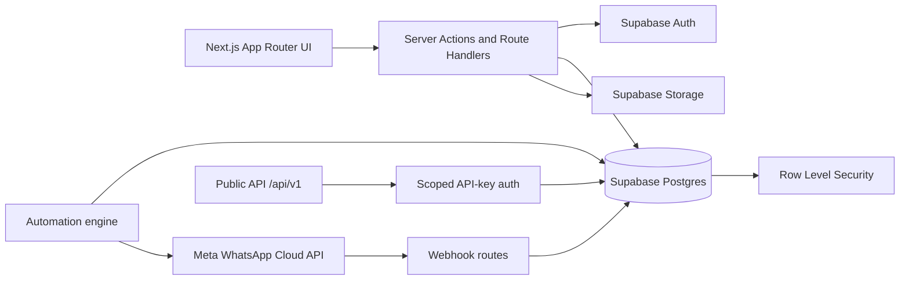
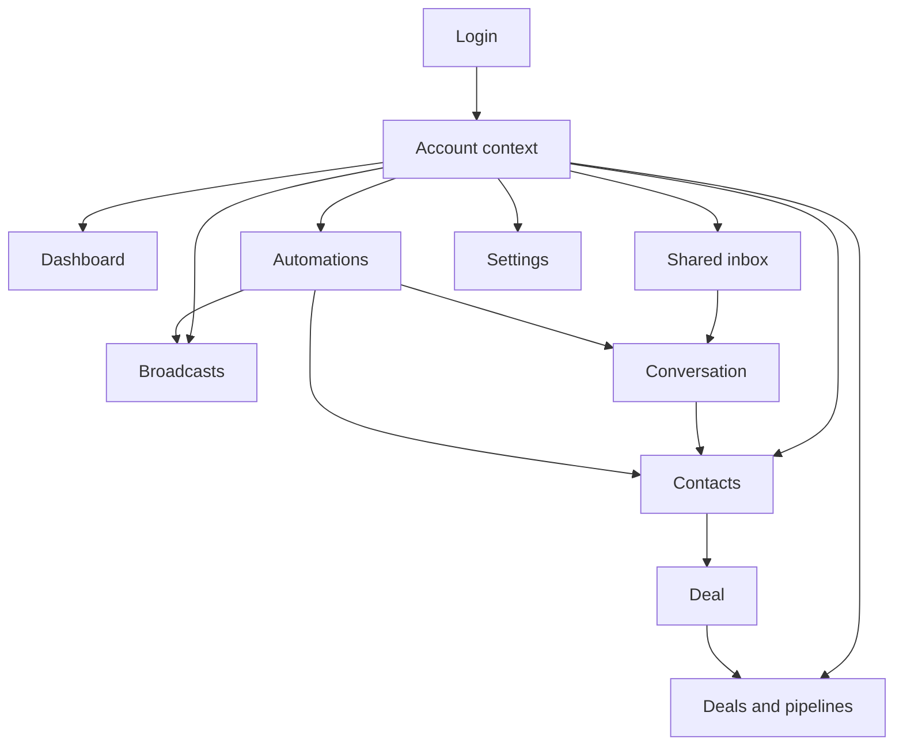

# Block 0 — Technical Baseline

Status: **in progress**

## Verified repository facts

- Runtime: Next.js 16, React 19, TypeScript.
- Data and authentication: Supabase Postgres, Auth, Storage, and Row Level Security.
- Styling: Tailwind CSS.
- Test runner: Vitest.
- Main product areas described by the repository: shared WhatsApp inbox, contacts, pipelines, broadcasts, automations, dashboard, team accounts, settings, and public API groundwork.
- Supported validation commands in `package.json`: `npm run typecheck`, `npm run lint`, `npm test`, and `npm run build`.
- Node.js requirement: version 20 or newer.
- Public API is not yet a complete product API; authentication groundwork and `/api/v1/me` exist while business data endpoints are incremental.

## Initial architecture map

## Product flow map

## Risks identified before implementation

| ID | Risk | Severity | Required treatment |
|---|---|---:|---|
| R-01 | The upstream template is contact/conversation/deal-oriented and does not guarantee a formal lead lifecycle. | High | Define the CRM domain before adding lead features. |
| R-02 | Conversation assignee and commercial owner can diverge without an explicit rule. | High | Model and display both responsibilities. |
| R-03 | Active records may exist without a next action. | High | Add invariant and controlled exception queue. |
| R-04 | Deletion can create orphaned actionable tasks or notifications if relationships are not explicit. | Critical | Prefer archival and enforce database integrity. |
| R-05 | Automations can conflict with human conversations or each other. | High | Add execution audit, versioning, loop protection, and suppression rules. |
| R-06 | Webhooks may be delivered more than once. | Critical | Enforce idempotency using provider event identifiers and unique constraints. |
| R-07 | Public API rate limiting is process-local. | Medium | Use shared rate-limit storage before horizontal scaling. |
| R-08 | Visual redesign before domain stabilization will cause rework. | High | Keep UX work after Blocks 1–8. |
| R-09 | RLS mistakes can expose data across accounts even when the UI appears correct. | Critical | Add negative permission tests for every privileged path. |
| R-10 | A large single migration can be hard to validate and roll back. | High | Use small reversible migrations per block. |

## Required inventory before Block 0 can close

The following items still need source-level enumeration:

- all routes under the Next.js app directory;
- all API route handlers and server actions;
- all Supabase migrations and persistent tables;
- all RLS policies and privileged service-role paths;
- all storage buckets and access policies;
- all webhook routes and event types;
- all automation triggers and actions;
- all pages and primary user journeys;
- all existing tests and their coverage gaps;
- environment variables and production dependencies.

## Validation gate

Block 0 may be marked complete only after:

- [ ] source tree inventory is committed;
- [ ] database entity map is committed;
- [ ] role/permission matrix is committed;
- [ ] integration/event map is committed;
- [ ] current test suite is executed successfully;
- [ ] production build is executed successfully;
- [ ] known failures are recorded with reproduction steps;
- [ ] no runtime behavior has changed.

## Execution constraint recorded

The GitHub connector can read and write repository files and create branches/PRs, but this session cannot clone the repository or run its Node.js toolchain because outbound network access for the local execution environment is unavailable. Therefore, code changes must not be described as validated until CI or an accessible runner actually executes the repository checks.
