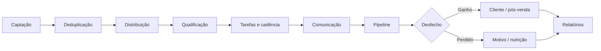

# WACRM — Estratégia de finalização do produto

## Objetivo

Transformar o fork atual do WACRM em um CRM comercial completo, estável e operável, no qual WhatsApp é um canal do processo de vendas — não o centro isolado do produto.

O produto final deve sustentar o ciclo completo:

## Princípios de execução

1. **Diagnosticar antes de redesenhar.** Nenhuma tela será considerada correta se o fluxo, o domínio ou a integridade dos dados estiverem incorretos.
2. **Uma fonte de verdade por conceito.** Contato, lead, oportunidade, tarefa, conversa e atividade terão responsabilidades diferentes.
3. **Operações críticas serão transacionais.** Criações compostas, mudanças de estágio e exclusões não poderão deixar dados parciais.
4. **Excluir será exceção.** Registros comerciais deverão usar arquivamento lógico e trilha de auditoria; exclusão física será restrita.
5. **Permissão será por capacidade.** Papéis predefinidos poderão existir, mas campanhas, automações, carteira, relatórios e administração terão permissões independentes.
6. **Multiempresa será garantida no banco.** Toda nova tabela terá `account_id`, RLS, índices e testes de isolamento.
7. **Mudanças passarão por branch e PR.** A `main` não receberá implementação direta.
8. **Cada bloco terá critério de entrada, saída e rollback.** Um bloco só fecha quando seus fluxos críticos estiverem testados.
9. **Migrações serão incrementais e reaplicáveis.** Não será reescrito o histórico já aplicado do Supabase.
10. **Design seguirá a operação.** A interface priorizará densidade, próxima ação, estado e contexto.

## Governança do projeto

- Branch de diagnóstico: `strategy/block-0-diagnostic`
- Branches futuras: `block/<numero>-<tema>`
- Merge preferencial: squash por bloco
- Migrações: somente novos arquivos numerados
- Mudanças destrutivas: exigem plano de migração, backup e rollback
- Toda correção deve incluir teste de regressão quando tecnicamente viável
- Toda funcionalidade deve incluir estados de carregamento, vazio, erro e permissão negada

## Decisão de baseline upstream

A `main` atual está no commit `077993266400a2ac6be58843324c8d8c87b03d3a` e é ancestral da linha atual do projeto original. O upstream possui 125 commits posteriores.

A atualização não será feita de forma automática. O Bloco 0 deve classificar as mudanças posteriores em três grupos:

- **Incorporar antes da customização:** correções de segurança, RLS, deduplicação, testes e integridade.
- **Avaliar separadamente:** notificações, mensagens interativas e melhorias de API.
- **Não incorporar agora:** módulos que ampliem escopo sem relação direta com a finalização, como IA e internacionalização, salvo decisão explícita de produto.

## Blocos de entrega

### Bloco 0 — Diagnóstico, baseline e congelamento

**Objetivo:** conhecer exatamente o sistema e impedir que novas funcionalidades aumentem a dívida antes da definição do produto.

Entregas:

- inventário de rotas, módulos, tabelas, APIs e integrações;
- mapa de dependências e fluxos existentes;
- classificação de riscos P0–P3;
- comparação controlada com upstream;
- backlog e critérios de aceite dos blocos seguintes;
- definição do modelo de domínio alvo.

Critério de saída:

- nenhuma entidade central indefinida;
- riscos P0 identificados e priorizados;
- baseline técnico aprovado;
- roadmap rastreado em issues.

### Bloco 1 — Domínio, integridade e banco de dados

**Objetivo:** criar a fundação de contato, lead, oportunidade, atividade, tarefa e auditoria.

Entregas:

- novas tabelas e enums;
- regras de transição;
- soft delete e arquivamento;
- histórico de eventos;
- chaves estrangeiras e índices;
- RLS e testes de isolamento;
- migração segura dos dados atuais.

Critério de saída:

- exclusão de contato não apaga histórico comercial inadvertidamente;
- mudanças de estado geram eventos;
- registros órfãos são impedidos por banco e serviço.

### Bloco 2 — Segurança, contas e permissões

**Objetivo:** separar administração da plataforma, administração da empresa e operação.

Entregas:

- matriz de capacidades;
- papéis predefinidos;
- equipes, carteira e escopo de visualização;
- substituição temporária e férias;
- auditoria de ações administrativas;
- revisão completa de middleware, APIs e RLS.

Critério de saída:

- nenhum usuário acessa dados de outra conta;
- funções sensíveis exigem capacidade específica;
- permissões são testadas no frontend, API e banco.

### Bloco 3 — Entrada e tratamento de leads

**Objetivo:** implementar o fluxo real da captação à qualificação.

Entregas:

- entrada manual, WhatsApp, CSV e API;
- normalização e deduplicação;
- origem, campanha e atribuição;
- distribuição por regras;
- SLA e primeira tarefa;
- formulário estruturado de qualificação;
- nutrição e descarte com motivo.

Critério de saída:

- todo lead tem origem, responsável ou fila e próxima ação;
- duplicidades são tratadas sem perder histórico;
- qualificação é mensurável.

### Bloco 4 — Tarefas, agenda e cadência

**Objetivo:** oferecer uma operação diária confiável.

Entregas:

- tarefas relacionadas a lead, contato, oportunidade e conversa;
- data, hora, prioridade, responsável, resultado e próxima ação;
- recorrência, lembretes e agenda;
- delegação e substituição;
- tratamento de tarefas atrasadas, canceladas e órfãs;
- notificações acionáveis.

Critério de saída:

- nenhuma tarefa ativa referencia registro inválido;
- concluir atividade exige resultado quando aplicável;
- o usuário encontra claramente o que fazer agora.

### Bloco 5 — Pipeline e processo comercial

**Objetivo:** transformar o Kanban em processo controlado, não apenas visual.

Entregas:

- critérios de entrada e saída por etapa;
- estado ganho/perdido independente da posição visual;
- motivo de perda;
- valor, probabilidade e previsão;
- histórico de movimentações;
- próxima atividade obrigatória;
- forecast e aging.

Critério de saída:

- mover para “Ganho” fecha a oportunidade de forma consistente;
- mudanças são auditadas;
- dashboard e pipeline apresentam os mesmos números.

### Bloco 6 — WhatsApp e atendimento

**Objetivo:** estabilizar a comunicação e desacoplar o CRM do provedor.

Entregas:

- contrato `WhatsAppProvider`;
- implementação Meta Cloud API;
- avaliação controlada de Evolution API;
- texto, áudio, vídeo, documento, imagem e estados;
- idempotência de webhook;
- reprocessamento e observabilidade;
- vínculo claro entre conversa, contato e lead.

Critério de saída:

- mensagens não duplicam nem desaparecem após reconexão;
- falhas são rastreáveis e reprocessáveis;
- histórico de mensagens permanece separado do histórico comercial.

### Bloco 7 — Marketing, campanhas e automações

**Objetivo:** conectar comunicação em massa a resultado comercial.

Entregas:

- campanha, segmento, consentimento e atribuição;
- origem/UTM;
- métricas de envio, resposta, qualificação, oportunidade e receita;
- versionamento e logs de automação;
- idempotência, retry e prevenção de loops;
- aprovação administrativa para ações de risco.

Critério de saída:

- campanha pode ser ligada a leads, oportunidades e receita;
- toda execução de automação é explicável.

### Bloco 8 — Novo UX/UI e design system

**Objetivo:** redesenhar a interface sobre os fluxos estabilizados.

Entregas:

- arquitetura de informação por Atendimento, Comercial, Marketing, Automação, Gestão e Configurações;
- design tokens e componentes;
- dashboard por função;
- lista e detalhe de lead;
- tarefas e agenda;
- pipeline responsivo;
- estados vazios e erros;
- acessibilidade e atalhos operacionais.

Critério de saída:

- tarefas prioritárias são encontradas sem navegação excessiva;
- padrões visuais e comportamentais são consistentes;
- fluxos críticos passam em testes de usabilidade.

### Bloco 9 — Gestão, relatórios e administração

**Objetivo:** dar controle operacional e gerencial.

Entregas:

- indicadores operacionais e gerenciais;
- metas, produtividade, conversão, forecast e perdas;
- relatórios por origem, campanha, equipe e responsável;
- auditoria e exportação;
- configurações de plano e recursos.

Critério de saída:

- números podem ser reconciliados com os registros de origem;
- gestores visualizam equipe sem receber privilégios de plataforma.

### Bloco 10 — Qualidade, implantação e aceite

**Objetivo:** preparar a versão candidata à produção.

Entregas:

- testes unitários, integração e E2E;
- cobertura dos fluxos críticos;
- segurança, desempenho e acessibilidade;
- backup, restore e rollback testados;
- observabilidade e alertas;
- documentação de implantação e operação;
- checklist de homologação.

Critério de saída:

- CI verde;
- migração testada em cópia do banco;
- restore comprovado;
- fluxos de aceite executados ponta a ponta.

## Definição global de pronto

Uma entrega só é considerada pronta quando:

- regra de negócio está documentada;
- banco e RLS protegem a regra;
- backend é idempotente quando necessário;
- frontend apresenta sucesso, erro, vazio e carregamento;
- teste de regressão cobre o risco principal;
- telemetria permite diagnosticar falhas;
- documentação foi atualizada;
- não há dependência oculta de dados locais ou do usuário criador.
