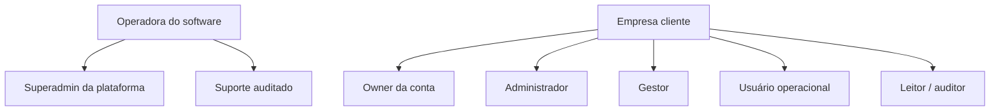
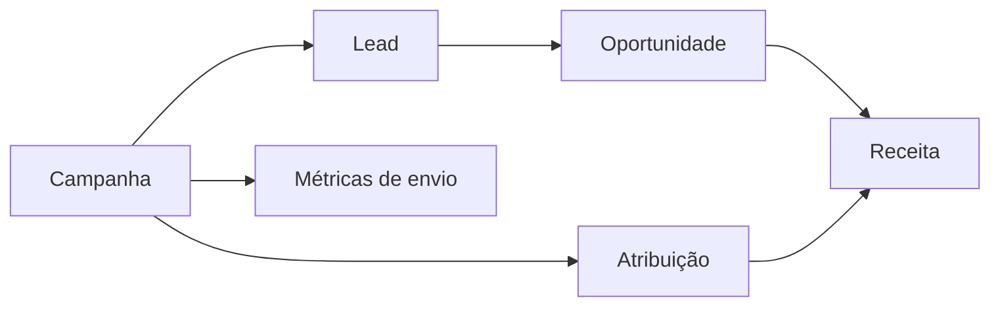

# Bloco 0 — Diagnóstico técnico, operacional e de usabilidade

## 1. Escopo da análise

Snapshot analisado:

- Repositório: `guilhermecostatoledo/wacrm`
- Branch: `main`
- Commit de referência: `077993266400a2ac6be58843324c8d8c87b03d3a`
- Stack: Next.js 16, React 19, TypeScript, Tailwind 4, Supabase/PostgreSQL/Auth/Storage/RLS, Meta Cloud API

Este documento descreve o estado encontrado. Não representa ainda uma especificação final de implementação.

## 2. Inventário funcional atual

A navegação principal oferece:

- Dashboard
- Inbox
- Contacts
- Pipelines
- Broadcasts
- Automations
- Flows (beta)
- Settings

O sistema é, em sua forma atual, uma caixa de entrada compartilhada com contatos, negócios, campanhas de WhatsApp e automações. Ele ainda não implementa o domínio completo de um CRM de captação e tratamento de leads.

## 3. Inventário de domínio atual

Entidades principais identificadas:

- conta e perfil;
- convite e papéis de conta;
- contato, tag, campo personalizado e nota;
- conversa, mensagem e reação;
- configuração e templates do WhatsApp;
- pipeline, etapa e negócio;
- broadcast e destinatário;
- automação, etapas, logs e execuções pendentes;
- fluxo visual e execuções.

Entidades centrais ausentes no snapshot:

- lead;
- tarefa e compromisso;
- atividade comercial estruturada;
- timeline de eventos/auditoria do domínio;
- notificação acionável;
- equipe/carteira/delegação temporária;
- campanha de marketing com atribuição a receita;
- origem e UTM estruturados;
- meta comercial;
- motivo de perda estruturado;
- cliente como estágio de relacionamento distinto;
- administração da plataforma separada da administração da empresa.

## 4. Classificação de severidade

- **P0 — bloqueador:** risco de perda de dados, segurança, isolamento ou inconsistência irreversível.
- **P1 — crítico:** fluxo principal produz resultado incorreto ou impede operação confiável.
- **P2 — importante:** dívida de arquitetura, escalabilidade ou usabilidade que aumenta custo e erro.
- **P3 — melhoria:** refinamento sem impedir o fluxo principal.

## 5. Achados prioritários

### P0.1 — Exclusão física de contato disparada diretamente pelo cliente

A tela de contatos executa `DELETE` diretamente no Supabase, inclusive em massa. O schema inicial liga conversas ao contato com `ON DELETE CASCADE`; mensagens são ligadas à conversa também com cascata.

Impacto possível:

- apagar uma pessoa pode apagar conversas e mensagens;
- automações, atividades e integrações podem perder contexto;
- não existe restauração funcional;
- não existe justificativa, auditoria ou aprovação;
- exclusões em massa ampliam o dano.

Ação:

- desabilitar exclusão física na interface;
- introduzir `archived_at`, `archived_by`, `archive_reason`;
- centralizar a operação em serviço transacional;
- reservar purge físico para política administrativa futura;
- criar teste de regressão para preservação do histórico.

### P0.2 — Ausência de histórico de eventos do domínio

O “activity feed” do dashboard é reconstruído consultando tabelas diferentes e misturando os últimos registros. Isso não constitui auditoria nem timeline completa.

Impacto:

- não é possível provar quem mudou uma etapa;
- valores anteriores não são preservados;
- exclusões e alterações de responsabilidade não são rastreáveis;
- bugs de tarefas/notificações não podem ser reconstruídos;
- relatórios podem divergir sem explicação.

Ação:

- criar `domain_events`/`audit_log` append-only;
- registrar ator, conta, entidade, ação, estado anterior, estado posterior, origem e correlação;
- separar eventos de segurança de eventos comerciais.

### P0.3 — Rotas protegidas inconsistentes

`/flows` aparece na navegação, mas não está na lista de caminhos protegidos do middleware.

Impacto:

- experiência inconsistente para usuário não autenticado;
- dependência excessiva de RLS para corrigir uma falha de roteamento;
- risco de novas páginas repetirem a omissão.

Ação:

- trocar lista manual por grupos de rota seguros ou matcher consistente;
- testar todas as rotas privadas;
- exigir autenticação interna também nas APIs.

### P1.1 — “Won” é uma etapa visual, não um estado comercial

O pipeline padrão cria uma etapa chamada `Won`, porém o drag-and-drop apenas atualiza `stage_id`. O campo `status` do negócio não é alterado e nenhum evento é registrado.

Impacto:

- negócio visualmente ganho pode continuar com status `open`;
- dashboard pode somar valor ganho como pipeline aberto;
- não há data de ganho, receita nem responsável pela mudança;
- mover o card de volta pode desfazer semanticamente uma venda sem controle.

Ação:

- separar `stage_id` de `lifecycle_status`;
- criar comandos transacionais `move`, `win`, `lose`, `reopen`;
- tornar etapas finais configuráveis, mas com semântica explícita;
- registrar motivo de perda e datas de fechamento.

### P1.2 — Não existe entidade Lead

Contato é usado como pessoa cadastrada; negócio é usado como card de pipeline. Não existe um registro intermediário para captação, origem, qualificação, SLA e distribuição.

Impacto:

- contato novo é tratado como lead mesmo quando já é cliente;
- uma pessoa não pode ter múltiplos ciclos de captação bem definidos;
- origem e qualificação ficam em tags/notas/campos livres;
- relatórios de conversão não têm base confiável.

Ação:

- criar `leads` ligado a `contacts`;
- permitir vários leads/oportunidades ao longo do relacionamento;
- definir estados e transições;
- migrar conceitos visuais sem duplicar contatos.

### P1.3 — Não existe entidade Tarefa

O snapshot não possui tabela, tipo, rota ou módulo central de tarefas.

Impacto:

- não há próxima ação obrigatória;
- SLA e cadência não podem ser gerenciados;
- férias, delegação e atrasos não podem ser tratados;
- notificações não têm objeto de negócio acionável.

Ação:

- criar tarefas polimorficamente relacionadas por tabela de vínculos ou colunas explícitas;
- controlar responsável, prazo, prioridade, tipo, resultado e recorrência;
- impedir tarefa ativa para entidade arquivada sem decisão explícita.

### P1.4 — Operações compostas não são transacionais

Exemplos observados:

- pipeline é criado e depois as etapas são inseridas em uma segunda operação;
- campos personalizados do contato são apagados e reinseridos;
- diversas escritas ocorrem diretamente no cliente.

Impacto:

- falha intermediária deixa pipeline sem etapas;
- falha após apagar campos perde valores anteriores;
- regras podem divergir entre telas, API pública e automações.

Ação:

- mover comandos compostos para RPC/route handler/service;
- usar transações no PostgreSQL;
- validar invariantes no banco;
- aplicar idempotency keys em integrações.

### P1.5 — Papel `agent` possui capacidades excessivas

A capacidade operacional atual inclui enviar mensagens, criar contatos, mover negócios, executar broadcasts e editar automações.

Impacto:

- vendedor pode alterar automações da empresa;
- operador pode disparar campanha em massa;
- não existe separação entre atendimento, SDR, closer, marketing e gestor.

Ação:

- introduzir capacidades granulares;
- manter papéis apenas como presets;
- diferenciar `broadcast.send`, `automation.manage`, `deal.manage`, `contact.manage`, `report.view`, `team.manage` etc.;
- validar a capacidade no frontend, API e RLS/serviço.

### P1.6 — Fork desatualizado em relação à base

O commit atual é ancestral do upstream, que possui 125 commits posteriores. Há correções e módulos relevantes, incluindo notificações, RLS adicional e deduplicação de conversas; também há expansões de escopo, como IA e internacionalização.

Impacto:

- manter o snapshot pode conservar bugs já corrigidos;
- mesclar tudo pode introduzir escopo e dependências desnecessários;
- customizar antes da decisão aumenta conflito futuro.

Ação:

- criar matriz de cherry-pick/merge por tema;
- incorporar primeiro correções de segurança e integridade;
- avaliar notificações e interatividade;
- adiar IA e internacionalização até definição de produto.

## 6. Engenharia de software

### Pontos fortes encontrados

- TypeScript e App Router;
- RLS por conta após a migração 017;
- criptografia de token e verificação HMAC declaradas;
- CI executa lint, typecheck, testes e build;
- componentes reutilizáveis;
- preocupação com realtime, reconexão e deduplicação no inbox;
- deduplicação de telefone adicionada posteriormente no snapshot;
- comentários técnicos explicam várias decisões complexas.

### Dívidas e riscos

#### 6.1 Tenancy e propriedade misturadas

`account_id` é o isolamento, enquanto `user_id` permanece em várias tabelas com significados diferentes: criador, proprietário ou responsável. Isso precisa ser normalizado no modelo alvo.

Recomendação:

- `created_by` para autoria;
- `owner_id`/`assigned_to` para responsabilidade;
- `account_id` somente para tenancy;
- `updated_by` e eventos para alterações.

#### 6.2 Uma conta por usuário é decisão rígida

A migração 017 assume uma única conta por usuário e guarda o papel no próprio perfil.

Limitações:

- consultor que atende mais de uma empresa;
- usuário interno da operadora do SaaS;
- suporte com acesso temporário;
- grupos empresariais;
- troca de empresa sem duplicar identidade.

Recomendação:

- avaliar `account_memberships` many-to-many antes de ampliar a base de clientes;
- separar identidade global de associação à empresa.

#### 6.3 Um número de WhatsApp por conta

A constraint atual define `UNIQUE(account_id)` para configuração do WhatsApp.

Recomendação:

- manter no MVP somente se for decisão comercial explícita;
- caso contrário, modelar `channels` e múltiplos números, com um canal padrão opcional.

#### 6.4 Agregações pesadas no cliente

O dashboard consulta mensagens e agrega séries/tempo de resposta no browser, com comentário explícito de que a solução é aceitável para poucos milhares de mensagens.

Riscos:

- payload alto;
- lentidão por conta grande;
- indicadores diferentes por timezone/navegador;
- custo crescente no Supabase;
- ausência de snapshots para métricas históricas.

Recomendação:

- RPCs agregadas;
- views/materialized views quando necessário;
- timezone da conta;
- snapshots para forecast e SLA.

#### 6.5 Cobertura sem meta e ausência de E2E

O CI executa testes, mas não há limiar de cobertura no `vitest.config.ts` e o `package.json` não inclui ferramenta E2E.

Recomendação:

- cobertura focada em regras críticas, não percentual vazio;
- Playwright para login, criação de lead, tarefa, pipeline, WhatsApp simulado e permissões;
- testes SQL/RLS em ambiente efêmero.

#### 6.6 Regras espalhadas entre cliente, API e banco

Há criação, atualização e exclusão diretamente nas páginas/componentes.

Recomendação:

- camada de comandos de domínio;
- queries separadas de mutations;
- contratos tipados;
- erros de domínio padronizados;
- UI sem conhecimento de detalhes de persistência.

## 7. UX/UI

### Pontos fortes encontrados

- feedback por toast;
- skeletons em módulos importantes;
- suporte mobile no sidebar e pipeline;
- acessibilidade básica no drag por teclado;
- preocupação com estados de realtime e hidratação;
- painel lateral contextual no inbox.

### Inconsistências

#### 7.1 Arquitetura de informação orientada ao template

O menu é uma lista plana de recursos técnicos. Para operação comercial, faltam agrupamentos mentais:

- Atendimento;
- Comercial;
- Marketing;
- Automação;
- Gestão;
- Configurações.

#### 7.2 Dashboard não responde “o que fazer agora?”

Os cards atuais medem conversas, contatos, valor aberto e mensagens. Faltam:

- tarefas vencidas;
- leads sem primeiro contato;
- conversas esperando;
- negócios sem próxima ação;
- SLAs estourados;
- agenda do dia.

#### 7.3 Detalhe do contato começa em “Details”

O painel possui Details, Tags, Notes, Custom Fields e Deals. Não existe uma timeline comercial nem ação seguinte.

Direção:

- resumo operacional no topo;
- timeline como visão principal;
- dados cadastrais como seção secundária;
- ações rápidas persistentes;
- histórico de WhatsApp separado, porém acessível.

#### 7.4 Pipeline permite movimentação sem validação

Arrastar um card não informa critérios, pendências ou consequência comercial.

Direção:

- preview da mudança;
- validação de campos obrigatórios;
- diálogo somente para transição que exige informação;
- desfazer quando seguro;
- indicação de aging e próxima tarefa no card.

#### 7.5 Linguagem e identidade herdadas

O produto ainda usa textos como “CRM Template for WhatsApp”, além de metadados do autor e repositório original.

Ação:

- definir nome e identidade do produto;
- padronizar linguagem em português do Brasil;
- evitar tradução parcial enquanto não houver estratégia de i18n.

## 8. Administrativo e governança

Ausências principais:

- superadmin da plataforma separado do cliente;
- unidades/equipes;
- carteira e escopo de dados;
- afastamento e substituição;
- trilha administrativa;
- plano e feature entitlements;
- política de retenção;
- suporte com acesso auditado;
- exportação e portabilidade de dados;
- restore por conta.

Direção:

## 9. Marketing e vendas

Broadcast não equivale a campanha de marketing completa.

Faltam:

- objetivo;
- origem/UTM;
- público e consentimento versionado;
- custo;
- respostas qualificadas;
- oportunidades geradas;
- receita atribuída;
- janela e regra de atribuição;
- exclusões/supressões;
- frequência e pressão de comunicação.

Direção:

## 10. Gestão de projeto

### Riscos de execução

- redesenhar antes de corrigir domínio;
- incluir IA antes de fechar o fluxo comercial;
- manter upstream em paralelo sem estratégia;
- aplicar migrações diretamente em produção;
- testar apenas o caminho feliz;
- continuar adicionando módulos sem critérios de aceite.

### Controles propostos

- um épico por bloco;
- issues pequenas e verificáveis dentro do bloco;
- demo e checklist ao final de cada bloco;
- banco de homologação com dados realistas;
- ADR para decisões irreversíveis;
- risk register revisado em cada PR;
- sem merge com CI vermelho ou migração sem rollback documentado.

## 11. Ordem recomendada de ação imediata

1. congelar features na `main`;
2. decidir baseline upstream;
3. criar testes para os riscos atuais antes de refatorar;
4. bloquear hard delete de contatos;
5. corrigir proteção de `/flows`;
6. especificar o modelo contato → lead → oportunidade;
7. especificar tarefa, atividade e evento;
8. implementar migrações do Bloco 1;
9. somente depois redesenhar os fluxos principais.

## 12. Critério de encerramento do Bloco 0

- [x] branch de diagnóstico criada;
- [x] roadmap inicial documentado;
- [x] lacunas de domínio identificadas;
- [x] riscos iniciais classificados;
- [x] divergência upstream quantificada;
- [ ] inventário completo de APIs e migrations validado;
- [ ] decisão upstream registrada em ADR;
- [ ] épicos e backlog criados;
- [ ] baseline de testes registrado;
- [ ] aprovação do modelo de domínio alvo.
