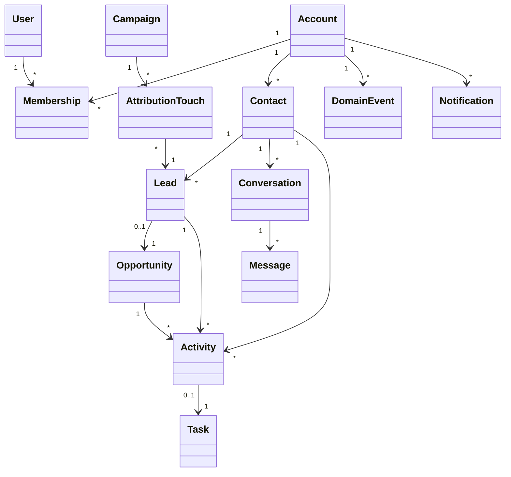
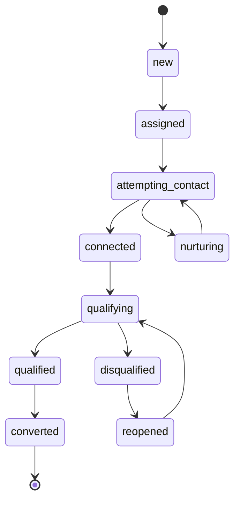

# Modelo de domínio alvo — CRM comercial

## 1. Objetivo

Definir responsabilidades e invariantes antes de criar tabelas ou telas. Este modelo evita que contato, lead, conversa e oportunidade sejam tratados como o mesmo conceito.

## 2. Visão geral

## 3. Identidade e tenancy

### User

Identidade global autenticada.

Campos essenciais:

- `id`
- `email`
- `full_name`
- `avatar_url`
- `status`
- `created_at`

Não deve guardar diretamente uma única empresa nem um único papel.

### Account

Empresa/tenant cliente.

Campos essenciais:

- `id`
- `name`
- `timezone`
- `default_currency`
- `status`
- `created_at`
- `archived_at`

### AccountMembership

Associação do usuário à empresa.

Campos essenciais:

- `account_id`
- `user_id`
- `role_preset`
- `status`
- `joined_at`
- `ended_at`

Invariantes:

- associação ativa é única por `(account_id, user_id)`;
- identidade pode participar de mais de uma conta;
- papel é preset, não a única fonte de autorização;
- acesso de suporte deve ser temporário e auditado.

### CapabilityGrant

Permissão granular por associação, papel ou equipe.

Exemplos:

- `contact.read`
- `contact.write`
- `lead.assign`
- `task.delegate`
- `deal.win`
- `deal.view_team`
- `broadcast.create`
- `broadcast.approve`
- `broadcast.send`
- `automation.manage`
- `report.view`
- `account.manage`

## 4. Relacionamento comercial

### Contact

Pessoa ou organização conhecida. É a identidade cadastral duradoura, não uma fase do funil.

Campos essenciais:

- `id`
- `account_id`
- `type` (`person`, `organization`)
- `name`
- `phone_normalized`
- `email_normalized`
- `document_normalized`
- `company_name`
- `lifecycle` (`prospect`, `customer`, `former_customer`, `partner`, `other`)
- `created_by`
- `created_at`
- `updated_at`
- `archived_at`

Invariantes:

- normalização ocorre no servidor/banco;
- duplicidade é avaliada por conta;
- arquivamento não apaga conversas, negócios ou eventos;
- fusão de contato preserva aliases e histórico.

### Lead

Uma manifestação de interesse/ciclo de captação. Um contato pode ter vários leads ao longo do tempo.

Campos essenciais:

- `id`
- `account_id`
- `contact_id`
- `source_id`
- `campaign_id`
- `owner_id`
- `team_id`
- `status`
- `priority`
- `qualification_score`
- `first_response_due_at`
- `first_contacted_at`
- `qualified_at`
- `disqualified_at`
- `disqualification_reason_id`
- `created_at`
- `archived_at`

Estados sugeridos:

Invariantes:

- lead ativo deve ter responsável ou fila;
- lead ativo deve ter próxima ação ou exceção registrada;
- conversão cria/vincula oportunidade de forma idempotente;
- desqualificação exige motivo;
- mudança de responsável gera evento.

### Opportunity

Oportunidade comercial com valor, etapa e previsão. Substitui semanticamente o uso genérico de `deals`, embora a tabela atual possa ser migrada/renomeada de forma compatível.

Campos essenciais:

- `id`
- `account_id`
- `lead_id`
- `contact_id`
- `pipeline_id`
- `stage_id`
- `owner_id`
- `title`
- `amount`
- `currency`
- `probability`
- `expected_close_date`
- `lifecycle_status` (`open`, `won`, `lost`, `cancelled`)
- `won_at`
- `lost_at`
- `loss_reason_id`
- `closed_by`
- `created_at`
- `updated_at`
- `archived_at`

Invariantes:

- etapa e estado comercial são conceitos separados;
- `won` exige `won_at` e não aceita `loss_reason_id`;
- `lost` exige `lost_at` e motivo;
- negócio aberto deve ter próxima atividade ou exceção;
- movimentação de etapa é comando transacional e gera evento;
- valores históricos não são inferidos apenas pelo estado atual.

## 5. Trabalho e relacionamento

### Activity

Registro imutável ou corrigível de uma interação/acontecimento comercial.

Tipos:

- ligação;
- WhatsApp;
- e-mail;
- reunião;
- visita;
- nota comercial;
- mudança de etapa;
- atribuição;
- proposta enviada;
- qualificação;
- sistema/automação.

Campos essenciais:

- `id`
- `account_id`
- `contact_id`
- `lead_id`
- `opportunity_id`
- `conversation_id`
- `type`
- `summary`
- `outcome`
- `occurred_at`
- `performed_by`
- `source` (`human`, `system`, `integration`, `automation`)
- `created_at`
- `corrected_by`
- `corrected_at`

Invariantes:

- atividade comercial não contém cópia de todas as mensagens;
- correção não remove o registro original sem trilha;
- mudanças automáticas também são explicáveis.

### Task

Compromisso futuro ou pendência acionável.

Campos essenciais:

- `id`
- `account_id`
- `contact_id`
- `lead_id`
- `opportunity_id`
- `conversation_id`
- `assigned_to`
- `created_by`
- `type`
- `title`
- `description`
- `priority`
- `status` (`open`, `in_progress`, `completed`, `cancelled`)
- `due_at`
- `completed_at`
- `completion_outcome`
- `recurrence_rule`
- `parent_task_id`
- `created_at`
- `updated_at`
- `archived_at`

Invariantes:

- tarefa aberta exige responsável e prazo, salvo fila explicitamente suportada;
- conclusão pode exigir resultado por tipo;
- cancelamento exige motivo quando provocado por arquivamento/exclusão;
- transferência preserva responsável anterior em evento;
- notificações derivam da tarefa, não substituem seu estado.

### Delegation

Substituição temporária para férias/afastamentos.

Campos essenciais:

- `account_id`
- `from_user_id`
- `to_user_id`
- `starts_at`
- `ends_at`
- `scope`
- `created_by`
- `revoked_at`

Escopos possíveis:

- novos leads;
- tarefas abertas;
- conversas;
- carteira;
- aprovações.

## 6. Comunicação

### Channel

Canal configurado da empresa.

Campos essenciais:

- `id`
- `account_id`
- `provider`
- `type` (`whatsapp` inicialmente)
- `display_name`
- `external_account_id`
- `external_phone_id`
- `status`
- `is_default`
- `credentials_encrypted`
- `created_at`

Invariantes:

- credenciais nunca chegam ao cliente;
- mais de um canal pode existir quando o produto permitir;
- webhook resolve conta e canal antes de criar dados.

### Conversation

Thread de comunicação por canal e contato.

Campos essenciais:

- `id`
- `account_id`
- `channel_id`
- `contact_id`
- `assigned_to`
- `status`
- `started_at`
- `last_message_at`
- `closed_at`

Invariantes:

- regra de unicidade ativa deve ser explícita por canal/contato;
- arquivar contato não remove conversa;
- atribuição gera evento;
- mensagens são idempotentes pelo identificador externo.

### Message

Evento de comunicação.

Campos essenciais:

- `id`
- `account_id`
- `conversation_id`
- `external_message_id`
- `direction`
- `sender_type`
- `content_type`
- `text`
- `media_asset_id`
- `status`
- `sent_at`
- `delivered_at`
- `read_at`
- `failed_at`
- `error_code`

Invariantes:

- identificador externo é único no contexto do canal;
- webhook é idempotente;
- mídia possui política de retenção;
- falha é observável e reprocessável quando seguro.

## 7. Marketing e atribuição

### Campaign

Iniciativa comercial/marketing, diferente de um lote técnico de mensagens.

Campos essenciais:

- `id`
- `account_id`
- `name`
- `objective`
- `channel`
- `budget`
- `starts_at`
- `ends_at`
- `status`
- `created_by`

### Broadcast

Execução de envio vinculável a uma campanha.

Campos adicionais recomendados sobre a estrutura atual:

- `campaign_id`
- `segment_snapshot_id`
- `approved_by`
- `approved_at`
- `consent_policy_version`
- `idempotency_key`

### AttributionTouch

Vínculo entre campanha/origem e lead.

Campos essenciais:

- `campaign_id`
- `lead_id`
- `touch_type` (`first`, `last`, `assisted`)
- `occurred_at`
- `source`
- `medium`
- `utm_campaign`
- `external_click_id`

## 8. Eventos, auditoria e notificações

### DomainEvent

Log append-only das transições do domínio.

Campos essenciais:

- `id`
- `account_id`
- `entity_type`
- `entity_id`
- `event_type`
- `actor_type`
- `actor_id`
- `source`
- `correlation_id`
- `before_data`
- `after_data`
- `metadata`
- `occurred_at`

Uso:

- timeline;
- auditoria;
- investigação de bugs;
- disparo confiável de automações;
- métricas de transição.

### Notification

Projeção acionável para um usuário, derivada de tarefa/evento/SLA.

Campos essenciais:

- `id`
- `account_id`
- `user_id`
- `type`
- `entity_type`
- `entity_id`
- `state` (`unread`, `read`, `resolved`, `dismissed`, `invalidated`)
- `action_url`
- `created_at`
- `read_at`
- `resolved_at`

Invariantes:

- ler não significa resolver;
- notificação deve ser invalidada quando a ação deixa de existir;
- duplicidade é evitada por chave lógica.

## 9. Política de arquivamento e exclusão

### Arquivamento padrão

Aplicável a:

- contatos;
- leads;
- oportunidades;
- tarefas;
- campanhas;
- usuários/memberships.

Comportamento:

- remove de listas padrão;
- mantém histórico e vínculos;
- cancela/invalida itens derivados conforme regra explícita;
- permite restauração quando seguro.

### Exclusão física

Permitida somente para:

- dados sem relevância legal/comercial e sem dependentes;
- purge por política de retenção;
- atendimento a solicitação de privacidade após anonimização e análise;
- ambientes de teste.

Toda exclusão física administrativa exige:

- capacidade específica;
- confirmação forte;
- motivo;
- evento de auditoria;
- relatório de impacto;
- job assíncrono/reprocessável quando o volume exigir.

## 10. Estratégia de migração

### Fase A — Compatibilidade

- criar novas tabelas sem remover as atuais;
- adicionar `created_by`, `assigned_to` e eventos;
- manter `deals` como armazenamento inicial de Opportunity;
- criar views/adapters compatíveis.

### Fase B — Migração funcional

- introduzir Leads e Tasks;
- converter criação de contato em fluxo de entrada configurável;
- substituir escritas diretas por comandos;
- registrar eventos retroativos mínimos quando possível.

### Fase C — Consolidação

- remover `profiles.role` legado;
- migrar de perfil único para memberships, se aprovado;
- renomear/normalizar colunas ambíguas;
- remover caminhos de escrita antigos após telemetria confirmar desuso.

## 11. Decisões que exigem ADR

- ADR-001: atualizar upstream inteiro, seletivamente ou manter snapshot;
- ADR-002: `AccountMembership` many-to-many;
- ADR-003: Meta apenas ou abstração com Evolution API;
- ADR-004: um ou vários números/canais por conta;
- ADR-005: manter nome `deals` ou migrar para `opportunities`;
- ADR-006: event log único versus audit/security logs separados;
- ADR-007: política de retenção e anonimização;
- ADR-008: execução síncrona versus fila para automações e notificações.

## 12. Critérios de aprovação deste modelo

- contato não representa etapa comercial;
- lead possui ciclo próprio;
- oportunidade possui fechamento controlado;
- tarefa representa trabalho futuro;
- atividade representa o que ocorreu;
- mensagem não polui a timeline comercial;
- evento explica toda transição crítica;
- notificação é derivada e acionável;
- permissões são por associação e capacidade;
- arquivamento preserva histórico.
