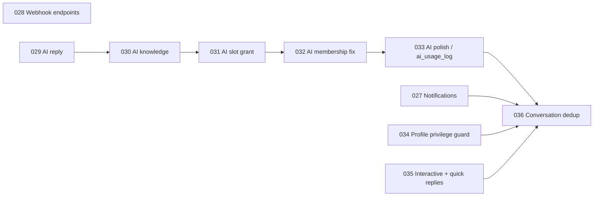

# Auditoria de dependências das migrations 027–036

## Resultado

O código do upstream 0.8.1 passou por lint, typecheck, testes e build no fork. Isso não comprova que uma sequência customizada de migrations funcionará. A revisão SQL identificou dependências que impedem a remoção ingênua dos módulos de IA.

## Mapa resumido

A seta `033 → 036` é relevante porque a função de deduplicação executa `UPDATE ai_usage_log`. Sem a tabela, a criação/execução da função falha.

## Migration 027 — Notifications

### Pontos positivos

- isolamento por `account_id`;
- destinatário explícito;
- criação server-side por trigger;
- cliente não pode inserir ou apagar;
- update limitado à coluna `read_at`;
- realtime habilitado.

### Limitações para o CRM alvo

- suporta somente `conversation_assigned`;
- possui apenas estado lida/não lida;
- não distingue `resolved`, `dismissed` e `invalidated`;
- `conversation_id` usa `ON DELETE CASCADE`, portanto a notificação desaparece junto com a conversa;
- não há chave lógica de deduplicação;
- não está vinculada a tarefa, lead, oportunidade ou SLA;
- o trigger engole qualquer falha com warning, o que preserva a atribuição, mas pode ocultar perda de notificação sem telemetria.

### Decisão

Manter como base técnica temporária, mas evoluir o modelo no Bloco 1/4. Não tratar essa tabela como modelo final de notificações.

## Migration 028 — Outbound webhooks

### Pontos positivos

- endpoint por conta;
- segredo HMAC criptografado;
- filtros de eventos;
- contador atômico de falha;
- desativação automática;
- administração restrita a admin+.

### Limitações

- não existe tabela durável de tentativas/entregas;
- não há dead-letter queue;
- `failure_count` e `last_delivery_at` não explicam cada falha;
- promessa de entrega é best-effort;
- eventos são validados no app, não por enum/tabela no banco.

### Decisão

Incorporar no baseline, mas criar delivery log, retry com backoff e idempotency/event ID antes de usá-lo em integrações críticas.

## Migrations 029–033 — IA

### Dependências

- configuração de provider e credenciais;
- pgvector/knowledge base;
- controle de slots/respostas;
- colunas adicionais em conversa/mensagem;
- `ai_usage_log` criado/consumido pela linha posterior.

### Decisão

Não expor IA no produto inicial. Para o banco existem duas opções seguras:

1. aplicar as migrations upstream intactas e manter o módulo desativado; ou
2. produzir uma sequência própria consolidada que adapte todas as referências posteriores.

A opção 1 reduz risco de migration no curto prazo. A opção 2 reduz dívida do produto, mas só deve ser usada após testes de banco limpo e upgrade.

## Migration 034 — Proteção de privilégio em profiles

### Risco corrigido

A política anterior permitia que o usuário atualizasse sua própria linha de perfil, incluindo `account_role` e `account_id`. Como RLS restringe linhas e não colunas, um viewer poderia tentar se promover ou mover para outra conta.

### Decisão

**Obrigatória.** É independente das tabelas de IA e deve existir no baseline antes de qualquer uso multiusuário real.

### Débito remanescente

A própria migration informa que não existe harness automatizado de testes SQL. Precisamos criar testes reais de RLS e coluna, não depender apenas de validação manual.

## Migration 035 — Mensagens interativas e quick replies

### Pontos positivos

- payload estruturado preservado na mensagem;
- quick replies compartilhadas por conta;
- RLS por membership.

### Limitações

- `user_id` usa `ON DELETE CASCADE`; remover o autor pode apagar quick replies compartilhadas da empresa;
- agente pode criar, editar e excluir qualquer quick reply;
- não há versionamento nem autoria histórica;
- falta capacidade separada de administração.

### Decisão

Incorporar após trocar autoria para `created_by ... ON DELETE SET NULL` e alinhar as capacidades.

## Migration 036 — Deduplicação de conversa

### Pontos positivos

- consolida duplicatas sem perder mensagens;
- reponta filhos antes da exclusão;
- recalcula resumo e unread count;
- cria garantia única no banco;
- resolve concorrência que não pode ser tratada apenas no app.

### Dependências problemáticas

A função referencia diretamente:

- messages;
- message_reactions;
- deals;
- flow_runs;
- notifications;
- `ai_usage_log`.

Se qualquer tabela não existir, a função não é portável para uma sequência reduzida.

### Decisão

Incorporar, mas adaptar a implementação do baseline próprio para lidar somente com tabelas existentes ou usar SQL condicional por catálogo. A garantia única `(account_id, contact_id)` deve ser preservada.

## Estratégia recomendada para o baseline

### Curto prazo — menor risco

- partir do upstream completo;
- aplicar migrations intactas em ambiente de homologação;
- ocultar/desabilitar IA na interface e APIs;
- manter tabelas de IA sem uso temporariamente;
- aplicar contenções P0 próprias;
- validar upgrade com cópia do banco.

### Consolidação antes da versão 1.0

- gerar baseline de instalação nova consolidado;
- manter migrations incrementais para instalações existentes;
- remover dependências de IA da deduplicação;
- decidir purge das tabelas de IA somente após backup e script reversível;
- adicionar harness SQL para RLS, FKs, constraints e idempotência.

## Testes obrigatórios de banco

- [ ] banco vazio: 001 → 036 sem erro;
- [ ] snapshot atual: 027 → 036 sem perda;
- [ ] usuário viewer não altera `account_role`;
- [ ] usuário não troca `account_id`;
- [ ] convite, mudança de papel e transferência continuam funcionando;
- [ ] duplicatas de conversa são consolidadas;
- [ ] mensagens, reações, negócios e notificações são preservados;
- [ ] inserts concorrentes resultam em uma conversa;
- [ ] quick reply não desaparece ao remover autor;
- [ ] notificação é invalidada/resolvida conforme entidade de origem;
- [ ] rollback restaurável a partir de backup.

## Gate

Nenhuma migration será aplicada em produção até existir:

- cópia de homologação do banco;
- backup verificado;
- relatório de contagem antes/depois;
- tempo estimado de lock;
- script de validação pós-migration;
- procedimento de rollback.
